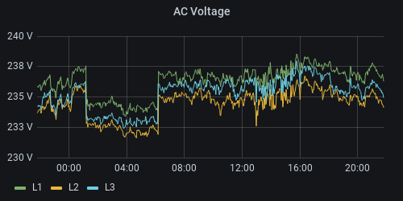

############
Flux queries
############

This page contains Flux queries for displaying various information from the tables. It focuses on the ``raw_data``
table, as the others are trivial to work with.

Grafana workarounds, InfluxQL vs. Flux
**************************************
Grafanas Flux support is still being worked on, and as such the comfort of using it with Flux is not on-par with the
InfluxQL support yet. The main problem that this page is working around is the inability to remap label names easily in
Grafana. This was done in InfluxQL by using ``GROUP BY tag(columnname)`` in the query and ``$_tag_columname`` in the
``ALIAS BY`` field of the query wizard. Here, for measurements that are similar to normal tables (they are pre-procesed by
RctMon and contain sensible field names) a simple, beautifying `` `rename()
<https://docs.influxdata.com/influxdb/v2.0/reference/flux/stdlib/built-in/transformations/rename/>`_`` is used.

But for the ``raw_data`` measurement, things are more complicated. The measurement uses tags to give meaning to the
fields (of which there are a few, such as ``value_float`` or ``value_string``). So in order to query the AC voltage of
Line 1 to 3, the query needs to first filter the measurement to only include the value rows whose name is
``g_sync.u_l_rms[0]`` through ``[2]`` and then apply a mapping that changes the name from ``g_sync.u_l_rms[0]`` to
``L1`` and so on.

.. hint::

   This is only a quick introduction to Flux. For the complete set, head over to the `Get started with Flux
   <https://docs.influxdata.com/influxdb/v2.0/query-data/get-started/>`_ page over at influxdata.com.

It's easier to just use a query as an example. In the example, the bucket is named ``rct-inverter`` and the inverter
itself is named ``PS 6.0 ASDF``. If you use only one inverter you may can omit filtering for the inverter name. Flux
works by reading from a data source (``from()``) and then passing the tabular data through a set of functions, like a
UNIX pipe.

.. code-block:: javascript

   from(bucket: "rct-inverter")
       // limit the time range (values from calling application, e.g. Grafana date-picker)
       |> range(start: v.timeRangeStart, stop: v.timeRangeStop)
       // narrow down the data we want
       |> filter(fn: (r) => r._measurement == "raw_data" and r._field == "value_float" and r.inverter == "PS 6.0 ASDF")
       // select the metrics we want
       |> filter(fn: (r) => r.name == "g_sync.u_l_rms[2]" or r.name == "g_sync.u_l_rms[1]" or r.name == "g_sync.u_l_rms[0]")
       // rename metrics to enable "nice" label names in Grafana using Display Name "${__field.labels.name}"
       |> map(fn: (r) => ({
           r with name:
               if r.name == "g_sync.u_l_rms[0]" then "L1"
               else if r.name == "g_sync.u_l_rms[1]" then "L2"
               else "L3"
         }))
       // aggregate into time buckets
       |> aggregateWindow(every: v.windowPeriod, fn: mean, createEmpty: false)
       // return the result
       |> yield(name: "AC Voltage")

Let's look at the parts line-by-line:

* ``from(bucket: "rct-inverter")`` states that it should read *from* the bucket ``rct-inverter``. This is the same name
  as set in the configuration, so this value may need adjustment depending on how the user set up their system.
* ``|> range(start: v.timeRangeStart, stop: v.timeRangeStop)`` reduces the data to the time range. The variable ``v``
  contains values from the calling system, in this case passed to Flux from the Grafana Date picker (or the date picker
  in the InfluxDB Data Explorer).
* ``|> filter(fn: (r) => r._measurement == "raw_data" and r._field == "value_float" and r.inverter == "PS 6.0 ASDF")``
  is the first filter that reduces the table by only letting rows pass on to the next line if the criteria matches. In
  this example, the *measurement name* (aka table name) must be ``raw_data``, and the field we want is ``value_float``
  for the voltage is a floating point value. Additonally, it limits by inverter name, which could be omitted if there's
  only one inverter (and thus one instance of RctMon) in use. This works by defining a function that is called for each
  row (hence the variable name ``r``) that is passed to it. ``r`` contains all the tags and fields.
* ``|> filter(fn: (r) => r.name == "g_sync.u_l_rms[2]" or r.name == "g_sync.u_l_rms[1]" or r.name == "g_sync.u_l_rms[0]")``
  further filters the data, by only passing on the three metrics we want, AC line voltage for the three phases.
* ``|> map(fn: (r) => ({ ... })`` defines a mapping of data. Each row that is processed is subject to the mapping in
  its body:

  * ``r with name:`` is a fancy way of saying: Return the row as-is **but** change the ``name`` attribute as follows.
    Without this, each of the rows attributes would need to be mapped manually (input-name → output-name, input-value →
    output-value and so on).
  * ``if r.name == "g_sync.u_l_rms[0]" then "L1"`` "returns" ``"L1"`` if the rows ``name`` attribute matches. With the
    previous line stating that it is working on the ``name`` attribute, ``"L1``" is assigned to the ``name`` attribute
    of the currently proccessed row. The if-statement can work with all the attributes of ``r``, it is not limited to
    ``name``.
  * ``else if r.name == "g_sync.u_l_rms[1]" then "L2"`` and ``else "L3"`` complete the mapping.

* ``|> aggregateWindow(every: v.windowPeriod, fn: mean, createEmpty: false)`` aggregates the window into the specified
  time window.
* ``|> yield(name: "AC Voltage")`` "returns" the data to the caller (Grafana). The name may be omitted if this is the
  only query that is run. Since Flux can yield more than one result in a single script, it is better to give it a
  meaningful name all the time. At the minimum, it helps you remember what it does when you look at it at a later point
  in time.

The result should look similar to this:

Querying from raw_data
**********************

AC voltage from power sensor
============================

